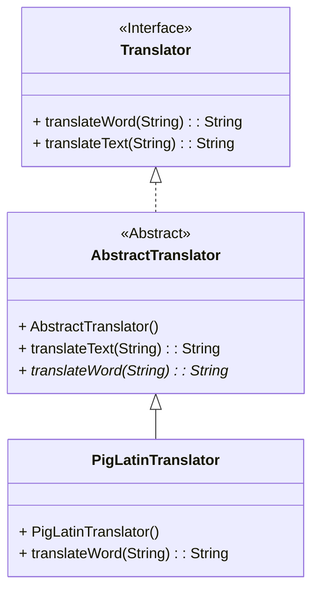

# PigLatin
## Description
---
thios is a simple program converting a sentence or a word of user's input into Pig Latin according to the following rule:
Most words in Pig Latin end in "ay." Use the rules below to translate normal English into Pig Latin.

* If a word starts with one or more consonants, move those consonants to the end of the word and add "ay."

  * Example: `happy` = `appyh` + `ay` = `appyhay`

  * Example: `child` = `ildch` + `ay` = `ildchay`

* If a word starts with a vowel add the word "way" at the end of the word.

  * Example: `awesome` = `awesome` + `way` = `awesomeway`

Putting It All Together

The sentence "Pig Latin is hard to speak." is written below in Pig Latin:

*Igpay Atinlay isway ardhay otay eakspay.*

Notice how "Igpay" is actually "Pig." Because the first character of pig is moved to the end, with "ay" added to the end, it makes Pig Latin hard to read.

The `PigLatinTranslator` is the concrete class doing conversion. It extends the Abstract class `AbstractTranslator` and implement the abstract method `translateWord()` which uses java `regex` and `patttern` library to break the input word into groups and do translation. The `AbstractTranslator` 
implements the interface `Translator` where the `translateText()` method receive the user's input and convert its to individual words to pass in the `translateWord()` method. The relationship among these classes are illustrated in the following diagram:

The program can properly handle capitalized words. More features, such as preserving punctuation, is open for implementation.
